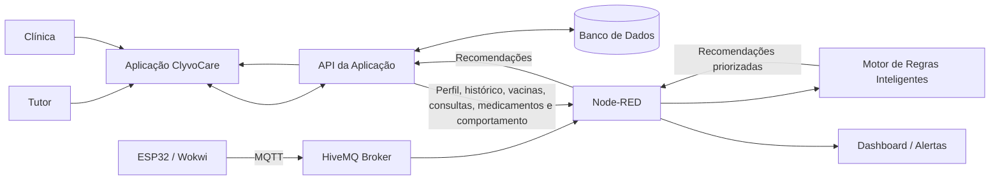

# 🐾 ClyvoCare OS — Sistema de Saúde do Pet

> **IoT + MQTT + Inteligência Artificial para apoio ao cuidado preventivo de pets**  
> Protótipo acadêmico — FIAP · Disruptive Architectures: IoT, IoB & Generative IA

---

## 📋 Sumário

- [O Problema](#-o-problema)
- [A Solução](#-a-solução)
- [Componente de Inteligência Artificial](#-componente-de-inteligência-artificial)
- [Benefícios da IA](#-benefícios-da-ia)
- [Dados Utilizados pela IA](#-dados-utilizados-pela-ia)
- [Arquitetura de Integração](#️-arquitetura-de-integração)
- [Tecnologias](#️-tecnologias)
- [Componentes IoT](#-componentes-iot)
- [Como Executar](#-como-executar)
- [Tópicos MQTT](#-tópicos-mqtt)
- [Estrutura do Repositório](#-estrutura-do-repositório)
- [Resultados Parciais](#-resultados-parciais)
- [Equipe](#-equipe)
- [Links](#-links)

---

## 🔴 O Problema

Durante a jornada contínua de cuidado do pet, diferentes informações são geradas, como perfil do animal, histórico clínico, vacinas, consultas, medicamentos e alterações de comportamento. O problema é que esses dados nem sempre são transformados em ações no momento adequado.

Entre os principais desafios estão:

- tutores podem esquecer vacinas, consultas e retornos clínicos;
- clínicas precisam acompanhar pendências e histórico de cada paciente;
- pets possuem necessidades diferentes de acordo com idade e fase de vida;
- alterações relevantes de comportamento podem passar despercebidas;
- informações clínicas isoladas dificultam a priorização dos próximos cuidados.

A proposta da IA no ClyvoCare OS é **analisar o contexto individual do pet e indicar quais ações de cuidado devem receber maior prioridade**, apoiando tutor e clínica na tomada de decisão.

---

## 💡 A Solução

O **ClyvoCare OS** integra IoT, MQTT, Node-RED e Inteligência Artificial para apoiar o acompanhamento preventivo do pet.

| Funcionalidade | Como funciona |
|---|---|
| 🌡️ Sensores IoT | ESP32 coleta temperatura, umidade, peso simulado e movimento |
| 📡 MQTT | HiveMQ realiza a comunicação entre ESP32 e Node-RED |
| 📊 Dashboard | Exibe os dados dos sensores e o status do pet |
| 💉 Calendário Vacinal | Verifica vacinas atrasadas ou próximas do vencimento |
| 🚨 Alertas | Identifica temperatura crítica e gera alerta |
| 🧠 Inteligência Artificial | Analisa dados do pet e gera recomendações priorizadas |

A Inteligência Artificial complementa o monitoramento ao transformar dados do pet em **recomendações personalizadas, priorizadas e justificadas**.

---

## 🧠 Componente de Inteligência Artificial

### Abordagem adotada

Para a Sprint 3 foi adotado um **Motor de Regras Inteligentes**, abordagem prevista no enunciado da disciplina.

A escolha foi feita porque os dados utilizados pelo ClyvoCare são predominantemente estruturados e possuem critérios objetivos, como:

- datas de vacinas;
- intervalo entre consultas;
- fase de vida do pet;
- retorno de tratamentos;
- percentual de alteração de atividade.

Essa abordagem permite gerar recomendações **determinísticas, explicáveis e auditáveis**, sem exigir uma grande base histórica para treinamento. Cada recomendação apresenta score, prioridade, motivo e os dados utilizados na análise.

> O componente funciona como **apoio à tomada de decisão** e não realiza diagnóstico veterinário.

### Problema tratado pela IA

O Motor de Regras Inteligentes busca responder à pergunta:

> **Qual cuidado deve ser priorizado para este pet neste momento?**

As regras implementadas analisam:

1. **Vacinação** — identifica vacina atrasada e aumenta a prioridade conforme o atraso.
2. **Consulta preventiva** — considera o tempo desde a última consulta e a fase de vida do pet.
3. **Retorno clínico** — verifica tratamento ativo com retorno recomendado e data já ultrapassada.
4. **Comportamento** — identifica redução relevante no nível de atividade.

### Estratégia de personalização

A personalização utiliza o contexto individual de cada pet. A frequência de consulta preventiva, por exemplo, é ajustada pela fase de vida:

| Fase de vida | Referência utilizada |
|---|---:|
| Filhote | 90 dias |
| Adulto | 180 dias |
| Idoso | 120 dias |

Além da fase de vida, o motor considera vacinas, consultas, medicamentos, histórico clínico e comportamento do animal.

### Priorização

Cada recomendação recebe um **score**. O score é convertido em prioridade:

| Score | Prioridade |
|---:|---|
| 90 ou mais | ALTA |
| 60 a 89 | MÉDIA |
| Abaixo de 60 | BAIXA |

As recomendações são ordenadas do maior para o menor score.

### Fluxo lógico da IA

```text
Dados do Pet
     ↓
Motor de Regras Inteligentes
     ↓
Análise das condições individuais
     ↓
Cálculo de score
     ↓
Classificação de prioridade
     ↓
Recomendações personalizadas
```

### Demonstração implementada

O flow do Node-RED possui o nó **Dados do Pet — Demonstração IA**, que simula os dados que seriam enviados pela aplicação/API para o componente de IA.

O cenário utiliza o pet **Thor**, cão adulto, com:

- vacina de Raiva atrasada;
- retorno de tratamento pendente;
- redução de 35% no nível de atividade;
- intervalo de consulta preventiva acima da referência para um pet adulto.

A análise gera quatro recomendações ordenadas por prioridade.

### Exemplo de saída real do Motor de Regras

```json
{
  "pet": {
    "id": "pet-001",
    "nome": "Thor",
    "especie": "cao",
    "faseVida": "adulto"
  },
  "abordagemIA": "Motor de regras inteligentes",
  "estrategiaPersonalizacao": "Regras ajustadas por fase de vida e contexto individual do pet",
  "totalRecomendacoes": 4,
  "recomendacoes": [
    {
      "servico": "Vacinação",
      "acao": "Agendar reforço de Raiva",
      "score": 93,
      "prioridade": "ALTA",
      "motivo": "Raiva está atrasada há 16 dia(s).",
      "dadosUtilizados": ["vacinas", "perfil"]
    },
    {
      "servico": "Retorno clínico",
      "acao": "Agendar retorno do tratamento em andamento",
      "score": 90,
      "prioridade": "ALTA",
      "motivo": "Data de retorno registrada passou há 11 dia(s).",
      "dadosUtilizados": ["medicamentos", "historicoClinico"]
    },
    {
      "servico": "Avaliação veterinária",
      "acao": "Sugerir avaliação por mudança de comportamento",
      "score": 80,
      "prioridade": "MEDIA",
      "motivo": "Atividade reduziu 35% em relação ao padrão registrado.",
      "dadosUtilizados": ["comportamento", "perfil"]
    },
    {
      "servico": "Consulta preventiva",
      "acao": "Agendar consulta de rotina",
      "score": 70,
      "prioridade": "MEDIA",
      "dadosUtilizados": ["perfil", "consultas", "historicoClinico"]
    }
  ]
}
```

---

## 🎯 Benefícios da IA

| Beneficiário | Valor gerado |
|---|---|
| **Tutor** | Recebe recomendações claras e priorizadas sobre os próximos cuidados do pet |
| **Clínica** | Identifica pendências e pacientes que precisam de acompanhamento com maior prioridade |
| **Pet** | Recebe acompanhamento preventivo mais adequado ao seu histórico e fase de vida |

---

## 📚 Dados Utilizados pela IA

Os dados foram organizados de forma estruturada para permitir análise pelo Motor de Regras Inteligentes.

| Dado | Origem | Estrutura / Exemplo | Utilização |
|---|---|---|---|
| Perfil do pet | Cadastro da aplicação | `id`, `nome`, `especie`, `idadeAnos`, `faseVida` | Personalizar regras e identificar o pet |
| Histórico clínico | Sistema da clínica | Array JSON com `data`, `tipo`, `observacao` | Fornecer contexto aos atendimentos |
| Vacinas | Cadastro e histórico | `nome`, `proximaDose`, `status` | Identificar vacina atrasada |
| Consultas | Histórico clínico | `data`, `tipo` | Calcular tempo desde a última consulta |
| Medicamentos / tratamentos | Histórico clínico | `nome`, `status`, `retornoRecomendado`, `dataRetorno` | Identificar retorno pendente |
| Comportamento | Tutor + IoT | `variacaoAtividadePercentual`, `origem` | Detectar alteração relevante de atividade |
| Sensores IoT | ESP32 | Temperatura, umidade, peso simulado e movimento | Monitoramento e apoio ao contexto do pet |

### Exemplo de entrada da IA

```json
{
  "dataReferencia": "2026-08-31",
  "perfil": {
    "id": "pet-001",
    "nome": "Thor",
    "especie": "cao",
    "idadeAnos": 3,
    "faseVida": "adulto"
  },
  "vacinas": [
    {
      "nome": "Raiva",
      "proximaDose": "2026-08-15",
      "status": "atrasada"
    }
  ],
  "consultas": [
    {
      "data": "2026-02-01",
      "tipo": "rotina"
    }
  ],
  "medicamentos": [
    {
      "nome": "Tratamento prescrito",
      "status": "ativo",
      "retornoRecomendado": true,
      "dataRetorno": "2026-08-20"
    }
  ],
  "comportamento": {
    "variacaoAtividadePercentual": -35,
    "origem": "PIR IoT + registro do tutor"
  }
}
```

---

## 🏗️ Arquitetura de Integração

A arquitetura abaixo representa como o componente de IA se integra à solução ClyvoCare. A aplicação, API e banco de dados representam a **arquitetura de integração proposta**. Na demonstração desta Sprint, os dados são simulados diretamente no Node-RED pelo nó **Dados do Pet — Demonstração IA**.



### Fluxo de dados

1. Tutor e clínica utilizam a aplicação ClyvoCare.
2. A aplicação se comunica com a API.
3. A API registra e consulta informações no banco de dados.
4. O ESP32 envia os dados IoT por MQTT para o HiveMQ.
5. O Node-RED recebe e processa os dados dos sensores.
6. Os dados estruturados do pet são encaminhados ao Motor de Regras Inteligentes.
7. O motor aplica as regras, calcula os scores e ordena as recomendações.
8. As recomendações podem ser disponibilizadas à aplicação, tutor e clínica.

---

## 🛠️ Tecnologias

| Tecnologia | Uso no Projeto |
|---|---|
| **ESP32 (Wokwi)** | Simulação do dispositivo IoT e leitura dos sensores |
| **DHT22** | Temperatura e umidade |
| **Potenciômetro** | Simulação de peso |
| **PIR HC-SR501** | Movimento e atividade |
| **Buzzer** | Alerta sonoro em temperatura crítica |
| **MQTT (HiveMQ)** | Comunicação entre ESP32 e Node-RED |
| **Node-RED** | Orquestração dos fluxos, alertas, calendário vacinal e Motor de Regras |
| **Motor de Regras Inteligentes** | Personalização, priorização e recomendação de cuidados |
| **ArduinoJson** | Serialização dos dados do ESP32 |
| **HTML/CSS/JavaScript** | Dashboard web |

---

## ⚡ Componentes IoT

### Sensores e atuadores

| Componente | Pino ESP32 | Função |
|---|---|---|
| DHT22 | GPIO 4 | Temperatura e umidade |
| Potenciômetro | GPIO 34 (ADC) | Simulação de peso |
| PIR HC-SR501 | GPIO 18 | Movimento e atividade |
| Buzzer | GPIO 19 | Alerta sonoro |
| LED Verde | GPIO 2 | Status da conexão |
| LED Vermelho | GPIO 5 | Indicação de alerta crítico |

### Regra de alerta implementada

| Parâmetro | Condição | Resultado |
|---|---|---|
| Temperatura alta | `> 39.2°C` | Alerta de febre, LED vermelho e buzzer |
| Temperatura baixa | `< 37.5°C` e `> 20°C` | Alerta de hipotermia, LED vermelho e buzzer |

> Umidade, peso e movimento são monitorados e exibidos no dashboard. Nesta versão, o alerta automático implementado no firmware é baseado em temperatura.

---

## 🚀 Como Executar

### 1. Simular o ESP32 no Wokwi

Na pasta `firmware/` estão os arquivos utilizados pela simulação:

```text
firmware/
├── sketch.ino
├── diagram.json
├── libraries.txt
└── wokwi-project.txt
```

1. Acesse [wokwi.com](https://wokwi.com).
2. Crie ou abra um projeto ESP32.
3. Copie o conteúdo de `firmware/sketch.ino` para o `sketch.ino` do Wokwi.
4. Copie o conteúdo de `firmware/diagram.json` para o `diagram.json` do Wokwi.
5. Configure as bibliotecas conforme `firmware/libraries.txt`.
6. Clique em **Start Simulation**.
7. Acompanhe os dados no Serial Monitor.

O protótipo utiliza:

```text
Broker: broker.hivemq.com
Porta: 1883
```

### 2. Instalar e iniciar o Node-RED

```bash
npm install -g --unsafe-perm node-red
node-red
```

Acesse:

```text
http://localhost:1880
```

### 3. Instalar o dashboard do Node-RED

No Node-RED:

1. Menu → **Manage Palette**.
2. Selecione **Install**.
3. Procure por `node-red-dashboard`.
4. Instale a biblioteca.

### 4. Importar o flow

1. Abra o Node-RED.
2. Menu → **Import**.
3. Selecione:

```text
node-red/clyvocare-nodered-flow.json
```

4. Clique em **Import**.
5. Confirme o broker `broker.hivemq.com` na porta `1883`.
6. Clique em **Deploy**.

### 5. Testar os sensores

Com o Wokwi rodando, o Node-RED recebe os tópicos de temperatura, umidade, peso e movimento. O dashboard pode ser acessado em:

```text
http://localhost:1880/ui
```

Para testar o alerta crítico, altere a temperatura do DHT22 para um valor acima de `39.2°C`.

### 6. Testar o calendário vacinal

1. No Node-RED, abra a aba **Debug**.
2. Localize o nó **Verificação Vacinas (a cada hora)**.
3. Clique no botão do nó.
4. Observe os alertas gerados no Debug.

### 7. Testar a Inteligência Artificial

1. Abra a aba **Debug** do Node-RED.
2. Localize **Dados do Pet — Demonstração IA**.
3. Clique no botão do nó.
4. Os dados passam pelo **Motor de Regras Inteligentes**.
5. Observe no Debug as recomendações, scores, prioridades e justificativas.

O resultado também é publicado no tópico MQTT:

```text
clyvocare/ia/recomendacoes
```

---

## 📡 Tópicos MQTT

| Tópico | Direção | Payload | Descrição |
|---|---|---|---|
| `clyvocare/esp32/temperatura` | ESP32 → Node-RED | Número | Temperatura em °C |
| `clyvocare/esp32/umidade` | ESP32 → Node-RED | Número | Umidade em % |
| `clyvocare/esp32/peso` | ESP32 → Node-RED | Número | Peso simulado em kg |
| `clyvocare/esp32/movimento` | ESP32 → Node-RED | `0` ou `1` | Estado do sensor PIR |
| `clyvocare/esp32/status` | ESP32 → MQTT | JSON | Estado completo do dispositivo |
| `clyvocare/alertas/critico` | ESP32 / Node-RED → MQTT | JSON | Alerta de temperatura crítica |
| `clyvocare/alertas/vacinas` | Node-RED → MQTT | JSON | Alertas do calendário vacinal |
| `clyvocare/ia/recomendacoes` | Node-RED → MQTT | JSON | Recomendações personalizadas e priorizadas pela IA |

### Exemplo de status publicado pelo ESP32

```json
{
  "device": "clyvocare-esp32-001",
  "temperatura": 38.4,
  "umidade": 72.1,
  "peso": 12.3,
  "movimento": 1,
  "timestamp": 45230,
  "versao": "1.0.0"
}
```

---

## 📁 Estrutura do Repositório

```text
clyvocare-os/
│
├── firmware/
│   ├── sketch.ino
│   ├── diagram.json
│   ├── libraries.txt
│   └── wokwi-project.txt
│
├── node-red/
│   └── clyvocare-nodered-flow.json
│
├── dashboard/
│   └── clyvocare-dashboard.html
│
└── README.md
```

Os arquivos com os links do GitHub e do vídeo são incluídos no `.zip` final da entrega.

---

## 📊 Resultados Parciais

### ✅ Implementado

- [x] ESP32 simulado no Wokwi.
- [x] Leitura de temperatura e umidade com DHT22.
- [x] Peso simulado com potenciômetro.
- [x] Detecção de movimento com PIR.
- [x] Comunicação MQTT utilizando HiveMQ.
- [x] Processamento dos dados pelo Node-RED.
- [x] Dashboard Node-RED com dados dos sensores.
- [x] Alerta crítico de temperatura com LED e buzzer.
- [x] Verificação de calendário vacinal.
- [x] Motor de Regras Inteligentes.
- [x] Personalização por fase de vida e contexto individual.
- [x] Priorização de recomendações por score.
- [x] Recomendação de vacinação, retorno clínico, avaliação e consulta preventiva.
- [x] Publicação das recomendações em MQTT.
- [x] Demonstração funcional simulada do componente de IA.

---

## 👥 Equipe

| Nome | RM |
|---|---:|
| Felipe Maglio Filho | 563512 |
| João Pedro Bitencourt Goldoni | 564339 |
| Marina Tamagnini Magalhães | 561786 |
| Mateus Granja dos Santos | 564930 |
| Vitória Valentina Maglio | 563509 |

---

## 🎬 Links

- 💻 **Repositório:** https://github.com/JoaoPedroBitencourtGoldoni/clyvocare-os
- 📺 **Vídeo Pitch Sprint 3:** `SUBSTITUIR_PELO_LINK_DO_VIDEO_NAO_LISTADO`
- 🐾 **Dashboard Node-RED:** `http://localhost:1880/ui`
- 🐾 **Dashboard Web:** `dashboard/clyvocare-dashboard.html`

---

*Projeto desenvolvido para a disciplina **Disruptive Architectures: IoT, IoB & Generative IA — FIAP 2026**.*
