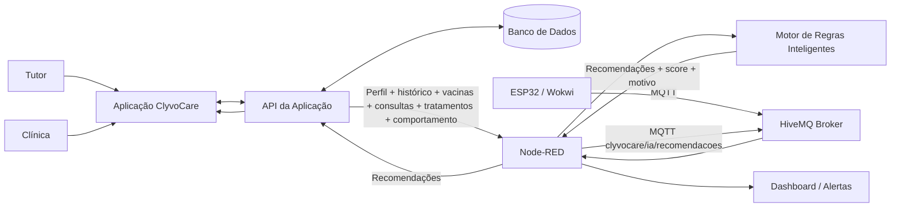
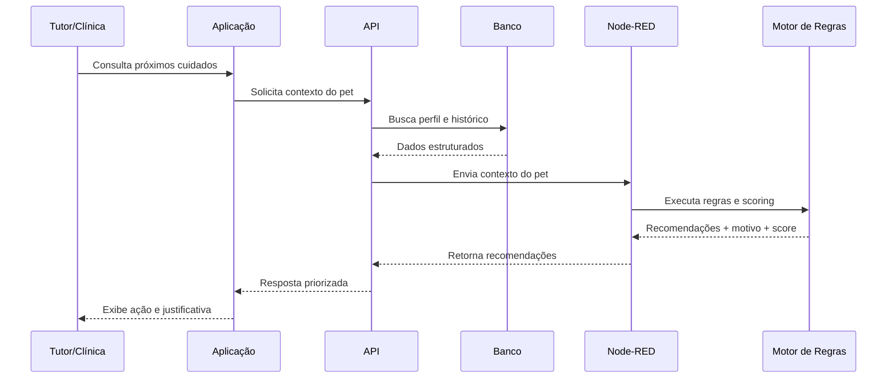

# Arquitetura e Fluxo de Dados — ClyvoCare OS

## 1. Visão arquitetural



## 2. O que está implementado nesta Sprint

O protótipo implementa e permite demonstrar:

```text
ESP32/Wokwi
   ↓ MQTT
HiveMQ
   ↓
Node-RED
   ├─ processamento dos sensores
   ├─ alertas
   ├─ calendário vacinal
   └─ Motor de Regras Inteligentes
          ↓
      recomendações priorizadas
          ├─ Debug Node-RED
          └─ MQTT: clyvocare/ia/recomendacoes
```

Para tornar a demonstração da IA reproduzível, o fluxo contém o nó **Dados do Pet — Demonstração IA**, que injeta um JSON estruturado do pet Thor no motor.

## 3. O que é integração proposta para a solução completa

A aplicação, a API e o banco de dados representam a integração da solução completa. Nessa evolução:

1. tutor e clínica cadastram/consultam dados na aplicação;
2. a aplicação consome a API;
3. a API persiste perfil e histórico no banco de dados;
4. a API envia um contexto estruturado do pet ao componente de IA;
5. o motor retorna recomendações explicáveis;
6. a API persiste/entrega essas recomendações para tutor e clínica;
7. dados IoT agregam contexto comportamental e ambiental.

Essa separação evita afirmar que App/API/DB já estão integrados nesta Sprint quando, na demonstração atual, os dados da IA são simulados no Node-RED.

## 4. Sequência da recomendação



## 5. Contrato lógico da IA

### Entrada

`perfil + vacinas + consultas + medicamentos + historicoClinico + comportamento + dataReferencia`

### Saída

`pet + abordagemIA + estrategiaPersonalizacao + recomendacoes[] + geradoEm + aviso`

A comunicação utiliza JSON, facilitando integração futura via API REST, mensageria ou função de serviço.

## 6. Tópicos relacionados à IA

| Tópico | Produtor | Consumidor | Finalidade |
|---|---|---|---|
| `clyvocare/ia/recomendacoes` | Node-RED | Aplicação/serviços interessados | Distribuir recomendações priorizadas |
| `clyvocare/esp32/movimento` | ESP32 | Node-RED | Apoiar contexto de atividade |
| `clyvocare/alertas/vacinas` | Node-RED | Aplicação/serviços interessados | Alertas do calendário vacinal |

## 7. Princípio de segurança

O componente de IA é de **apoio à decisão**. A arquitetura deve manter a clínica/profissional no circuito para decisões clínicas, especialmente em situações críticas ou quando uma recomendação resultar de dados incompletos.
